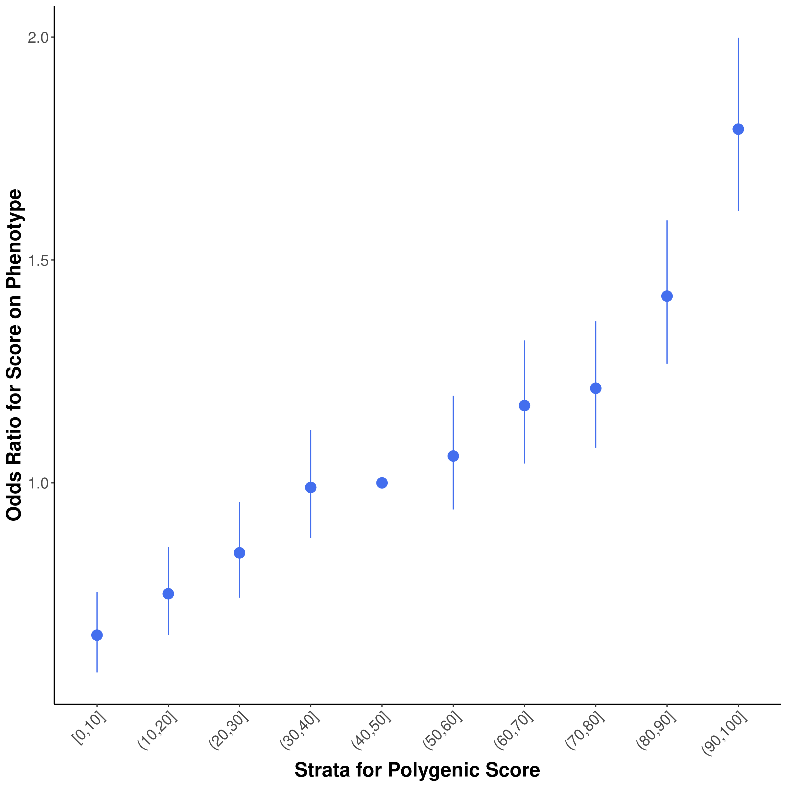

# Analyzing the results

## Evaluation metrics

The base-maf (base minor allele frequency) and maf (target minor allele frequency) filters were toggled with. However, there was no difference in the evaluation metrics obtained.

R2 was obtained from the summary file generated by PRSice as described [previously](prsice.md#output).

Using a merged dataframe containing phenotype, age, sex, and PRS, AUC is computed as follows in R:

```r
# Compute AUC for only PRS
auc_prs <- roc(df$PHENO, df$PRS)$auc

# Create GLM for PRS, age, and sex
prs_model <- glm(PHENO ~ PRS + Age + Sex, data = df, family = binomial)

# Get predicted probabilities from the model
predicted_probs <- predict(prs_model, type = "response")

# Compute combined AUC
auc_combined <- roc(df$PHENO, predicted_probs)$auc

# Print combined AUC
print(auc_combined)
```

| Evaluation metrics    | PGS000074 | PGS000785 |
| --------------------- | --------: | --------: |
| R2                    |    0.0505 |    0.0576 |
| AUC (only PRS)        |    0.5783 |    0.6058 |
| AUC (PRS + age + sex) |    0.6976 |    0.7095 |

## Distribution plots

|                PGS000074                |                  PGS000785                  |
| :-------------------------------------: | :-----------------------------------------: |
| .png>) |  |

## Odds ratio plots

|                                                PGS000074                                                |                                 PGS000785                                |
| :-----------------------------------------------------------------------------------------------------: | :----------------------------------------------------------------------: |
|  |  |
