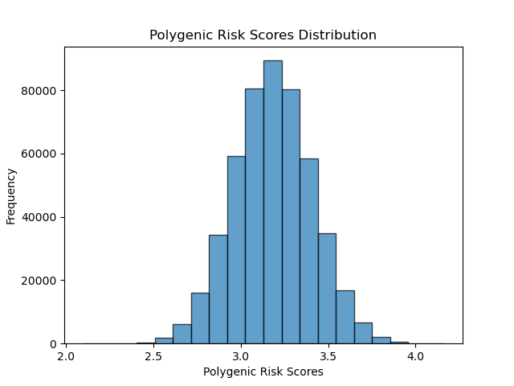

# Interpreting the scores

The PRS obtained from using Plink on the micro-array sequenced data was converted to percentiles based on our training data, the UK Biobank. As noticed before, the scores fall in a Gaussian distribution and this further helps us understand that most people are going to be at medium risk while only a small portion of people would have a high or low risk of contracting the disease.

<figure><figcaption><p>Polygenic Score Distribution using scoring file PGS000785 for the UK Biobank</p></figcaption></figure>

This data was appended to a CSV file called GastroATL.csv that showed the sample date, name, PRS, and percentile.


```python
#!/usr/bin/env python3

import sys
import os
import csv
import matplotlib.pyplot as plt
import numpy as np
from scipy.stats import percentileofscore

# Function to read polygenic risk scores from a tab-delimited file, skipping header
def read_polygenic_scores(file_path, score_column):
    scores = []
    with open(file_path, 'r') as file:
        # Skip the header line
        next(file)
        for line in file:
            columns = line.strip().split('\t')
            if len(columns) > score_column:
                score = float(columns[score_column])
                scores.append(score)
    return scores

# Function to create a distribution plot of polygenic risk scores
def plot_polygenic_scores_distribution(scores):
    plt.hist(scores, bins=20, edgecolor='black', alpha=0.7)
    plt.title('Polygenic Risk Scores Distribution')
    plt.xlabel('Polygenic Risk Scores')
    plt.ylabel('Frequency')
    #plt.savefig('polygenic_scores_distribution.png')  # Save the plot as an image
    #plt.show()

# Function to find the percentile of a given score in the distribution
def find_percentile(score, distribution):
    return percentileofscore(distribution, score)

# Function to append data to the CSV file
def append_to_csv(file_path, data):
    with open(file_path, 'a', newline='') as csv_file:
        csv_writer = csv.writer(csv_file)
        csv_writer.writerow(data)

def main():
    # Assign file paths
    ukb_file_path = '/home/vsrinivasan75/ukb_prs/using_plink/PGS000785/ukb_chr1-22_v1_nomean_PGS000785.sscore'
    tempus_file_path = sys.argv[1] if len(sys.argv) == 2 else None

    # Check if the second file path is provided
    if tempus_file_path is None:
        print("Usage: python script.py tempus_file_path")
        sys.exit(1)

    # Read polygenic risk scores from the UK Biobank file (5th column)
    polygenic_scores_ukb = read_polygenic_scores(ukb_file_path, score_column=4)

    # Plot the distribution of polygenic risk scores for the UK Biobank file
    plot_polygenic_scores_distribution(polygenic_scores_ukb)

    # Read polygenic risk scores from the Tempus file (4th column)
    polygenic_scores_tempus = read_polygenic_scores(tempus_file_path, score_column=3)

    # Example: Find the percentile of the first score from the Tempus file
    if polygenic_scores_tempus:  # Check if the list is not empty
        specific_score = polygenic_scores_tempus[0]
        percentile = find_percentile(specific_score, polygenic_scores_ukb)
        rounded_percentile = round(percentile, 2)
        print(f'The percentile of the score {specific_score} in the UKB distribution is: {rounded_percentile}%')
        
        # Extract required information from tempus_file_path
        tempus_file_parts = tempus_file_path.split('/')
        date = tempus_file_parts[-2].split('_')[0]  # Extract the part before the underscore
        id = tempus_file_parts[-1].split('.')[0]  # Extract until the first occurrence of "."

        # Check for duplicates before appending to the CSV file
        data_to_append = [date, id, specific_score, rounded_percentile]
        csv_file_path = 'GastroATL_PRS.csv'

        with open(csv_file_path, 'r') as csv_file:
            csv_reader = csv.reader(csv_file)
            for row in csv_reader:
                if row[:3] == data_to_append[:3]:  # Check if the first three columns match
                    print("Duplicate entry. Skipping...")
                    sys.exit(0)

        # Append the data to the CSV file
        append_to_csv(csv_file_path, data_to_append)
        print("Data appended to GastroATL_PRS.csv")

    else:
        print("The Tempus file does not contain any polygenic risk scores.")

if __name__ == "__main__":
    main()
```


The IDs have not been shown in the following results to maintain confidentiality.&#x20;

|  Score  | Percentile | Risk level |
| :-----: | :--------: | :--------: |
| 3.70134 |    98.89   |    High    |
|  3.5449 |    94.62   |    High    |
| 3.02005 |    23.38   |   Normal   |
|  3.5449 |    94.62   |    High    |
| 3.47531 |    90.38   |    High    |
| 2.98502 |    18.23   |   Normal   |
| 3.25902 |    63.44   |   Normal   |
| 3.06588 |    30.15   |   Normal   |
| 3.00619 |    21.51   |   Normal   |
| 2.60747 |    0.46    |     Low    |
| 3.10711 |    36.86   |   Normal   |
| 2.94345 |    14.12   |   Normal   |
| 3.29861 |    69.82   |   Normal   |
| 3.37211 |    80.12   |   Normal   |
| 3.16201 |    46.43   |   Normal   |
