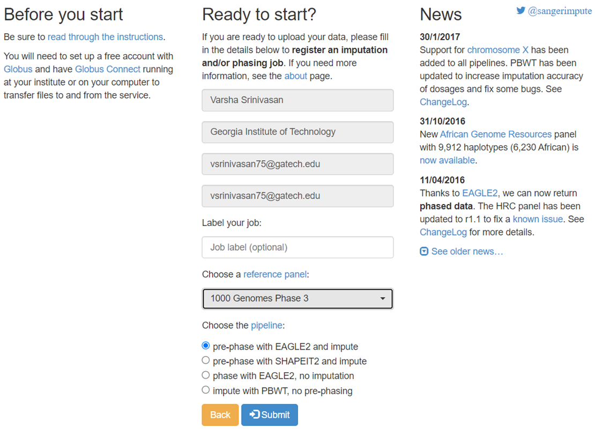

# Preparing the data and obtaining polygenic risk scores

## Imputing the data

The VCF files were imputed using the Sanger Imputation Service. The reference consortium chosen was the 1000Genomes Phase3 dataset and the data was pre-phased and imputed using EAGLE2.

<figure><figcaption><p>Image of the Sanger Imputation Service</p></figcaption></figure>

## Quality control

23 imputed VCF files were obtained for the autosomes and the X chromosome. The files were combined and prepared for input into Plink2.


```bash
# To combine all the VCF files
bcftools concat 1.vcf.gz 2.vcf.gz 3.vcf.gz 4.vcf.gz 5.vcf.gz 6.vcf.gz 7.vcf.gz 8.vcf.gz 9.vcf.gz 10.vcf.gz 11.vcf.gz 12.vcf.gz 13.vcf.gz 14.vcf.gz 15.vcf.gz 16.vcf.gz 17.vcf.gz 18.vcf.gz 19.vcf.gz 20.vcf.gz 21.vcf.gz 22.vcf.gz -Oz -o combined.vcf.gz

# To remove duplicate IDs
bcftools view -H combined.vcf.gz | awk '!seen[$3]++' >> output.vcf

# To compress and index the VCF file
bgzip output.vcf
tabix -p vcf output.vcf.gz
```


## Obtaining PRS using Plink2

This data was used as target data to compute PRS using Plink. The scoring file used was PGS000785.


```bash
plink2 
--vcf output.vcf.gz 
--score /home/vsrinivasan75/ukb_prs/PGS000785.txt 
1 4 6 no-mean-imputation 
--out patient_id
```

